```{r set diretorio, message=FALSE, warning=FALSE, include=FALSE}
library(DT)
 setwd("~/GitHub/R_empreendedorismo3")
```

# Agradecimentos
<br>
```{r agradecimentos, figures-side, fig.show="hold", echo=FALSE, out.height="100%", out.width="100%", fig.align='center', fig.height=4, fig.cap=" "}

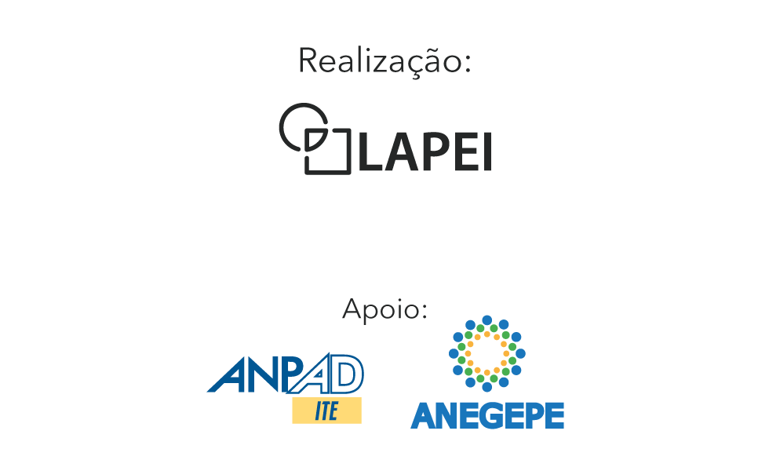

```


class: inverse, middle, left
# Divisão do curso 
* **Módulo 1: conceitos básicos de R** 
  + Cálculos básicos
  + Tipos de variáveis e objetos
  + O pacote dplyr para manipulação de dataframes
  + O pacote ggplot2 para visualização de dados
* **Módulo 2: usando o R para explorar o Global Entrepreneurship Monitor (GEM)**
  + Compreendedo as bases 
  + Tratando as bases 
  + Análise Exploratória dos Dados do GEM
* **Módulo 3: usando o R para explorar o Panel Study of Entrepreneurial Dynamics (PSED)**
  + Compreendendo a base
  + Tratando a base 
  + Análise Exploratória dos Dados do PSED

---
class: inverse, middle, left
# Objetivos do módulo 3
- Demonstrar relevância do PSED
- Explorar variáveis disponíveis no PSED 
- Aplicar funções para manipular dataframes 
- Aplicar análise exploratória dos dados

---
# Panel Study of Enterpreneurial Dynamics 

#### - O PSED foi conduzido em duas edições. O PSED I iniciou em 1998 e o PSED II teve início em 2004. 

#### - O PSED II foi uma iniciativa para coletar dados de uma amostra representativa de empreendedores americanos, ao longo do processo de criação de empresas, entre 2005 e 2011.   

#### - O PSED foi coordenado por Richard Curtin e Paul Reynolds e contou com apoio de diversos pesquisadores de empreendedorismo, dentre eles: Howard Aldrich, Per Davidsson, William Gartner, Benson Honig, Martin Ruef, Scott Shane, entre outros.

#### - O projeto foi conduzido no âmbito da Universidade de Michigan e contou com financiamento da Kauffman Foundation, US Small Business Administration e a National Science Foundation

#### - Para mais informações, acesse o [site](http://www.psed.isr.umich.edu/psed/home)

---
# Publicações

```{r artigo_psed, figures-side, fig.show="hold", echo=FALSE, out.height="90%", out.width="90%", fig.align='center', fig.height=3}

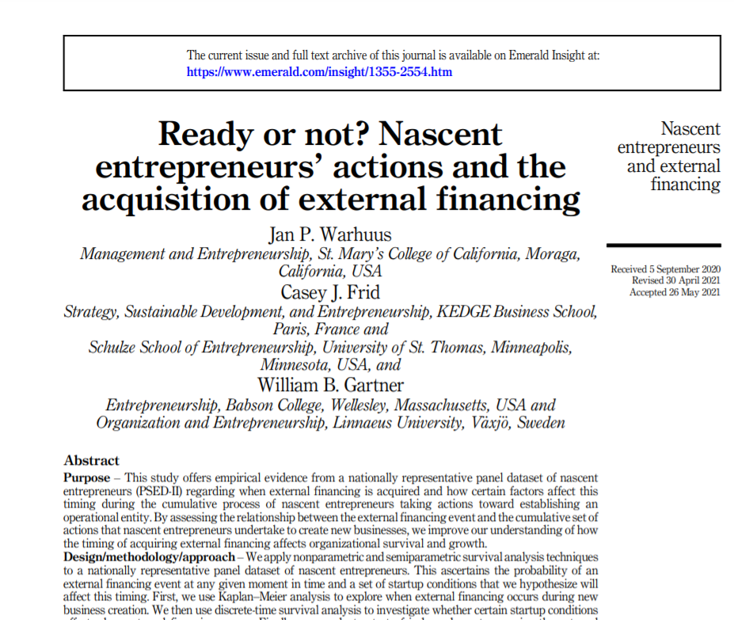
```
---
# Publicações

```{r artigo_psed2, figures-side, fig.show="hold", echo=FALSE, out.height="90%", out.width="90%", fig.align='center', fig.height=3}

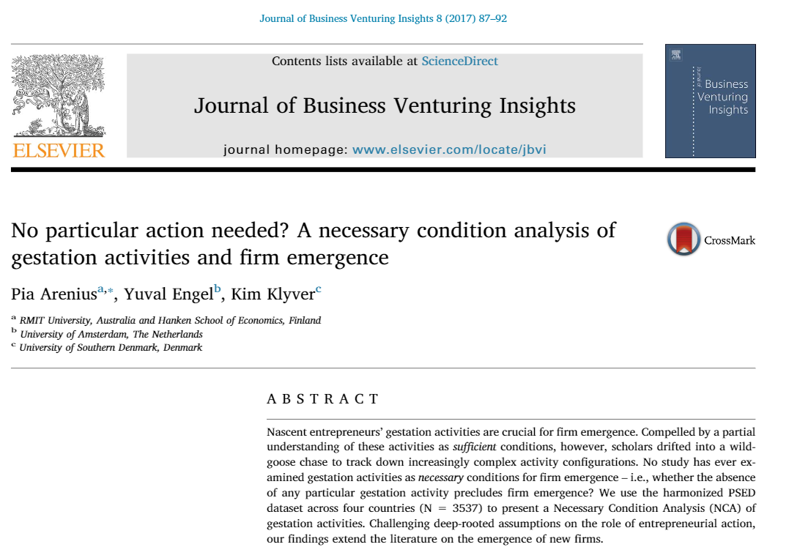
```
---
# Publicações

```{r artigo_psed3, figures-side, fig.show="hold", echo=FALSE, out.height="90%", out.width="90%", fig.align='center', fig.height=3}

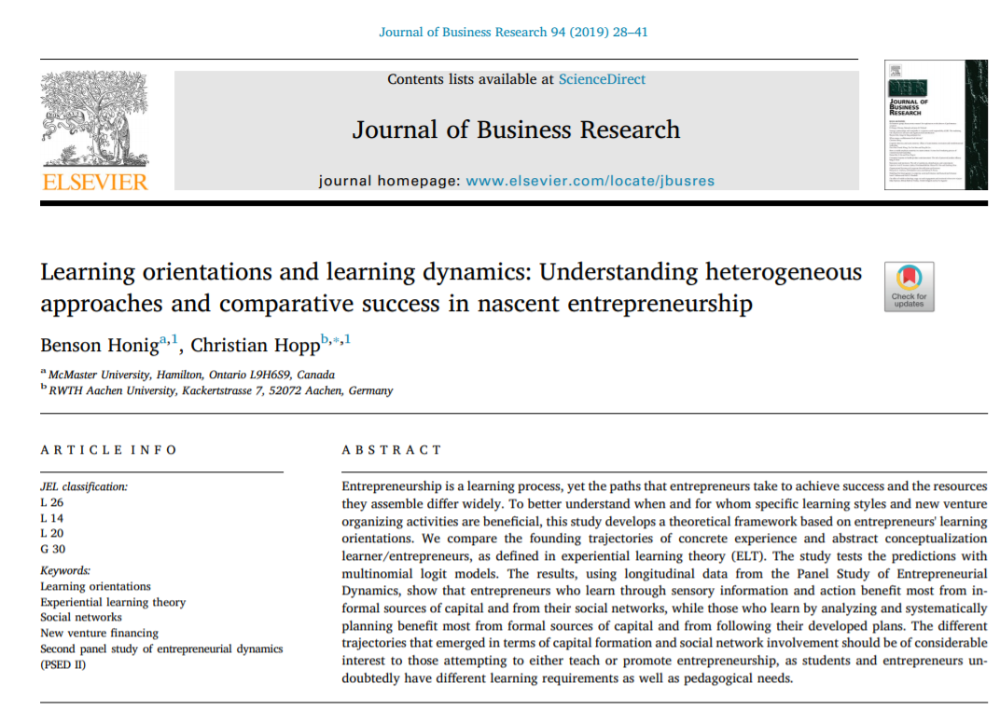
```
---
# Potencial do PSED 

Capacidades dinâmicas

```{r cd, figures-side, fig.show="hold", echo=FALSE, out.height="90%", out.width="90%", fig.align='center', fig.height=3}

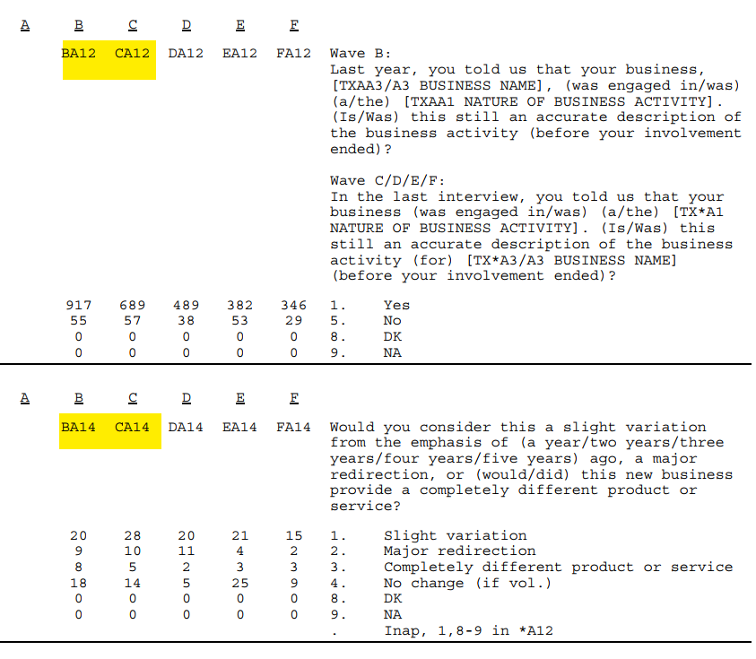
```

---
# Potencial do PSED 

Plano de negócios 

```{r pn, figures-side, fig.show="hold", echo=FALSE, out.height="90%", out.width="90%", fig.align='center', fig.height=3}

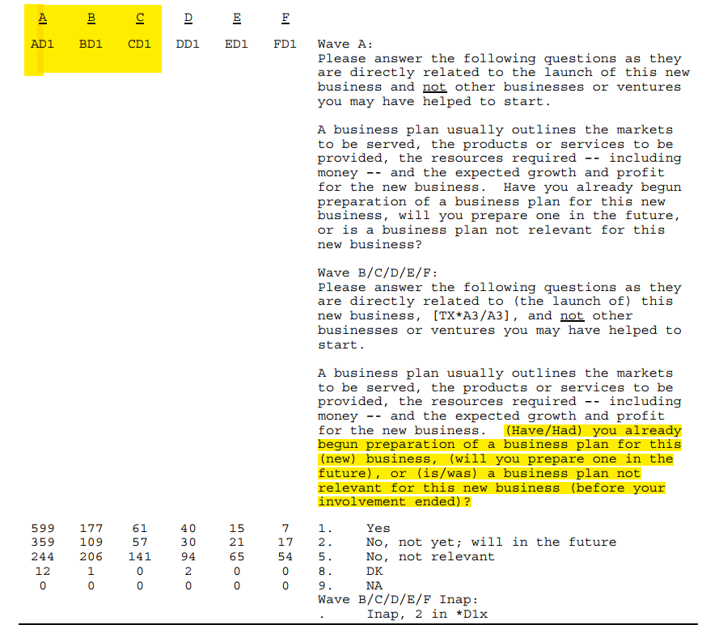
```

---
# Potencial do PSED 

Conversa com potenciais clientes 

```{r clientes, figures-side, fig.show="hold", echo=FALSE, out.height="90%", out.width="90%", fig.align='center', fig.height=3}

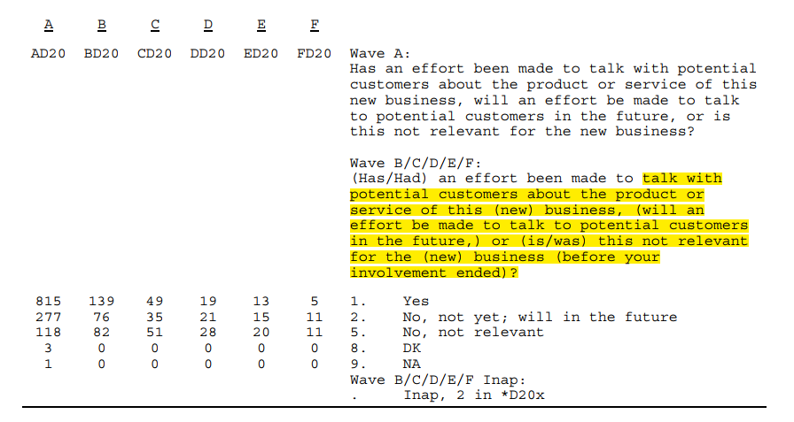
```

---
# Potencial do PSED 

Perfil dos empreendedores 

```{r demografics, figures-side, fig.show="hold", echo=FALSE, out.height="90%", out.width="90%", fig.align='center', fig.height=3}

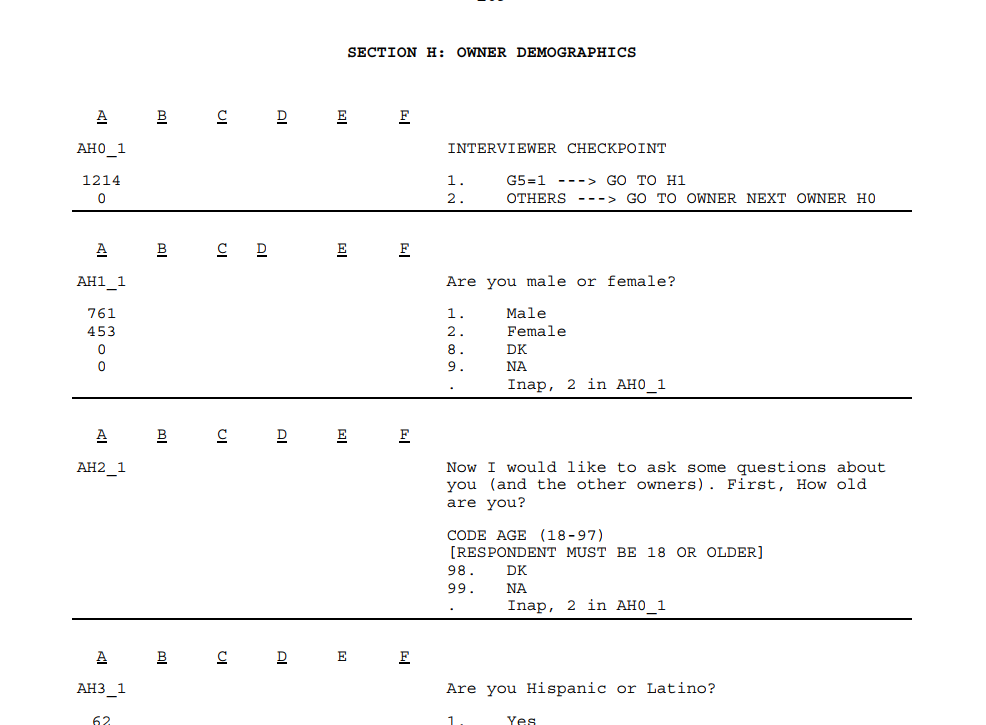
```

---
# Potencial do PSED 
Finanças 

```{r financas, figures-side, fig.show="hold", echo=FALSE, out.height="90%", out.width="90%", fig.align='center', fig.height=3}

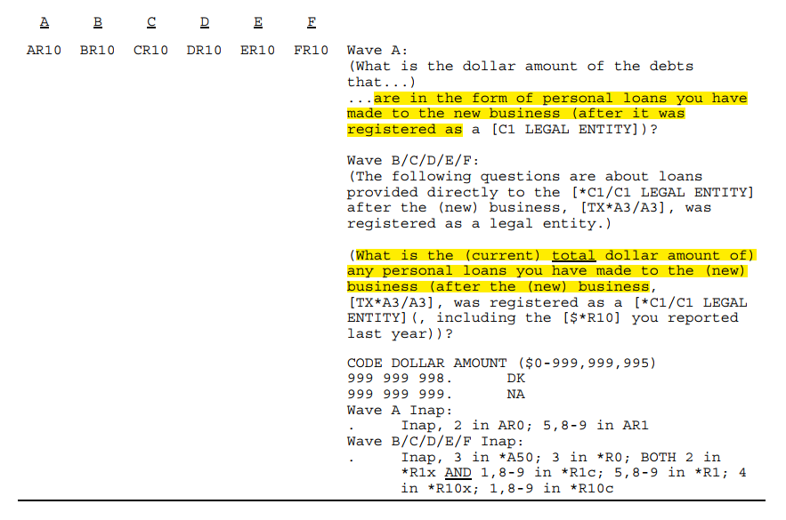
```

---
# Potencial do PSED 
Inovação 

```{r inovacao, figures-side, fig.show="hold", echo=FALSE, out.height="90%", out.width="90%", fig.align='center', fig.height=3}

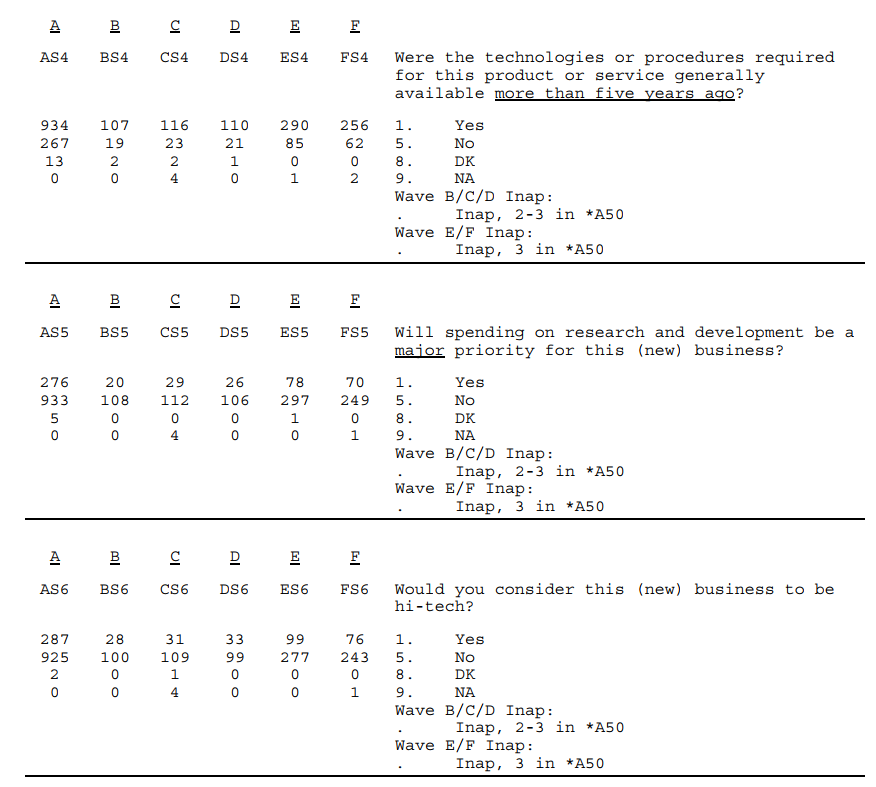
```

---
# Potencial do PSED 
Internacionalização

```{r internacionalizacao, figures-side, fig.show="hold", echo=FALSE, out.height="90%", out.width="90%", fig.align='center', fig.height=3}

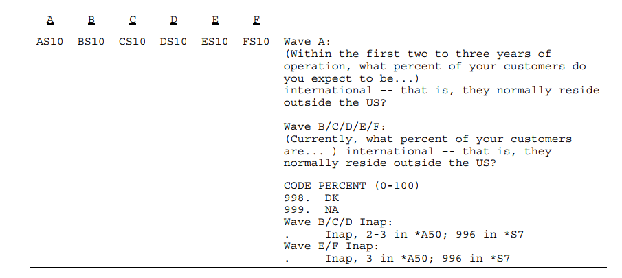
```


---
# Potencial do PSED 
Motivação 

```{r motivacao, figures-side, fig.show="hold", echo=FALSE, out.height="90%", out.width="90%", fig.align='center', fig.height=3}

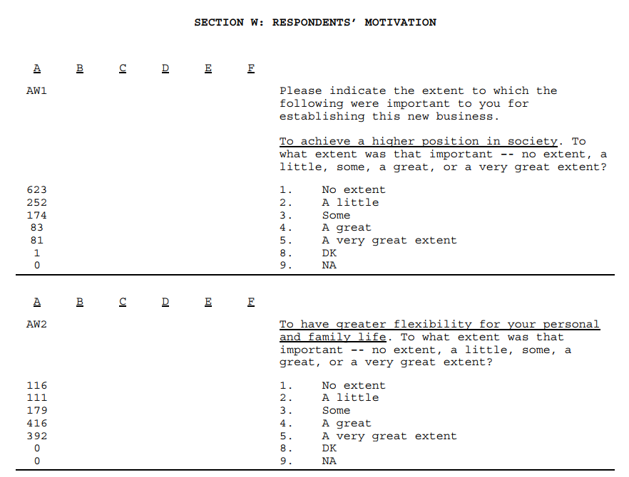
```

---
# Tratando a base

```{r lendo_base, message=FALSE, warning=FALSE}
library(tidyverse)
library(foreign)

setwd("~/LAPEI/Curso R Lapei/modulo extra")

psed <- read.spss("psedii_scrn_ABCDEF.sav", use.value.labels = FALSE)
psed_df <- as.data.frame(psed)

# Para baixar a base, retire o # e rode a linha.  
# psed_df <- read_csv("https://raw.githubusercontent.com/danielppagotto/R_empreendedorismo3/main/arquivos%20de%20bases/psed_2.csv") 

```
---
# Filtrando e selecionando dados
Filtrando base para manter apenas empreendedores solo e cujos negócios estão operantes na wave E. 

```{r filter}
# filtrando para manter os negócios operantes
psed_tratado <- psed_df %>% 
  filter(AG2 <2 & BA50 != 3 & CA50 != 3 & DA50 != 50 & EA50 != 3)

# selecionado variáveis
psed_tratado <- psed_tratado %>%  
  select(AG2, AH1_1, AH2_1, AH6_1, AH11_1,AH12_1, AH13_1,
         AQ4_1, AQ5_1, AQ6_1, AQ7_1, AQ8_1, AQ9_1, AQ10_1,  
         BQ4_1, BQ5_1, BQ6_1, BQ7_1, BQ8_1, BQ9_1, BQ10_1,  
         CQ4_1, CQ5_1, CQ6_1, CQ7_1, CQ8_1, CQ9_1, CQ10_1, 
         DQ4_1, DQ5_1, DQ6_1, DQ7_1, DQ8_1, DQ9_1, DQ10_1, 
         EQ4_1, EQ5_1, EQ6_1, EQ7_1, EQ8_1, EQ9_1, EQ10_1, 
         AS5, AS8, AS9, ES5, ES8, ES9, 
         AP1, AP2, AP3, AP4, AP5, AP6, AP7, AP8, AP9, AP10, AP11, AP12, 
         EP1, EP2, EP3, EP4, EP5, EP6, EP7, EP8, EP9, EP10, EP11, EP12)

```

Para conhecer as variáveis selecionadas, acesse o dicionário de dados que preparamos para o curso ou o [codebook](http://www.psed.isr.umich.edu/psed/download_node/198) do PSED.

---
# Tratamentos - demografia
A partir desse ponto, faremos muitos tratamentos na base antes de iniciar qualquer análise. 

```{r}
# recodificando sexo, escolaridade e renomeando variáveis
psed_tratado <- psed_tratado%>% 
  mutate(sexo = ifelse(AH1_1 == "1", "Masculino","Feminino"),.after=AH1_1) %>% 
  mutate(escolaridade = case_when(AH6_1 < 4 ~ "Até EM",
                                  AH6_1 >= 4 & AH6_1 < 8 ~ "Ensino Superior",
                                  AH6_1 >= 8 ~ "Pós-graduação"),.after=AH6_1) %>% 
  rename(idade = AH2_1, industria = AH11_1, empreendedorismo = AH12_1,
         negocios_possui = AH13_1, pesq_desenv_a = AS5, pesq_desenv_e = ES5, 
         regional_a = AS8, regional_e = ES8, nacional_a = AS9, nacional_e = ES9)

# adicionando o status "NA" em variáveis preenchidas pelo valor 999999998, conforme dicionário de dados
psed_tratado[psed_tratado == 999999998] <- NA
psed_tratado[psed_tratado == 999999999] <- NA

```

---
# Tratamentos - finanças
Vamos criar variáveis considerando a fonte de financiamento: resersas pessoais, 3F (family, friends and fools) e crédito. 

```{r financiamento}

psed_tratado <- psed_tratado %>% 
  rowwise() %>% 
  mutate(personal_savings_A = sum(c(AQ4_1),na.rm = TRUE),.after = AQ4_1) %>% 
  mutate(fff_A = sum(c(AQ5_1,AQ6_1),na.rm = TRUE), .after = AQ6_1) %>% 
  mutate(credit_A = sum(c(AQ7_1,AQ8_1,AQ9_1,AQ10_1),na.rm = TRUE),.after = AQ10_1) %>% 
  mutate(personal_savings_B = sum(c(BQ4_1),na.rm = TRUE),.after = BQ4_1) %>% 
  mutate(fff_B = sum(c(BQ5_1,BQ6_1),na.rm = TRUE), .after = BQ6_1) %>% 
  mutate(credit_B = sum(c(BQ7_1,BQ8_1,BQ9_1,BQ10_1),na.rm = TRUE),.after = BQ10_1) %>% 
  mutate(personal_savings_C = sum(c(CQ4_1),na.rm = TRUE),.after = CQ4_1) %>% 
  mutate(fff_C = sum(c(CQ5_1,CQ6_1),na.rm = TRUE), .after = CQ6_1) %>% 
  mutate(credit_C = sum(c(CQ7_1,CQ8_1,CQ9_1,CQ10_1),na.rm = TRUE),.after = CQ10_1) %>%
  mutate(personal_savings_D = sum(c(DQ4_1),na.rm = TRUE, .after = DQ4_1)) %>%
  mutate(fff_D = sum(c(DQ5_1,DQ6_1),na.rm = TRUE), .after = DQ6_1) %>% 
  mutate(credit_D = sum(c(DQ7_1,DQ8_1,DQ9_1,DQ10_1),na.rm = TRUE),.after = DQ10_1) %>% 
  mutate(personal_savings_E = sum(c(EQ4_1),na.rm = TRUE),.after = EQ4_1) %>% 
  mutate(fff_E = sum(c(EQ5_1,EQ6_1),na.rm = TRUE), .after = EQ6_1) %>% 
  mutate(credit_E = sum(c(EQ7_1,EQ8_1,EQ9_1,EQ10_1),na.rm = TRUE),.after = EQ10_1)  

```

---
# Tratamentos - finanças
Vamos criar variáveis financeiras com o acumulado de cada wave

```{r}
psed_tratado <- psed_tratado %>%
  mutate(ps_acumulado_B = personal_savings_A + personal_savings_B,
         ps_acumulado_C = ps_acumulado_B + personal_savings_C,
         ps_acumulado_D = ps_acumulado_C + personal_savings_D,
         ps_acumulado_E = ps_acumulado_D + personal_savings_E,
         fff_acumulado_B = fff_A + fff_B,
         fff_acumulado_C = fff_acumulado_B + fff_C,
         fff_acumulado_D = fff_acumulado_C + fff_D,
         fff_acumulado_E = fff_acumulado_D + fff_E,
         credit_acumulado_B = credit_B + credit_A,
         credit_acumulado_C = credit_acumulado_B + credit_C,
         credit_acumulado_D = credit_acumulado_C + credit_D,
         credit_acumulado_E = credit_acumulado_D + credit_E) 

```

---
# Tratamento - normas sociedade
Renomeando algumas das variáveis sobre normais sociais. Vamos utilizar apenas algumas. Por isso, renomeei apenas algumas das variáveis sobre a comunidade.
```{r}
psed_tratado <- psed_tratado %>%
                  rename(suporte_comunidade_a = AP1, autonomia_a = AP2, risco_a = AP3,
                         criatividade_a = AP4, suporte_comunidade_e = EP1, 
                         autonomia_e = EP2, risco_e = EP3, criatividade_e = EP4)

```

---
# Selecionando dados após tratamentos

```{r select}
psed_tratado <- psed_tratado %>% 
  select(sexo, idade, escolaridade, industria, empreendedorismo, negocios_possui,
         personal_savings_A, personal_savings_B, personal_savings_C, personal_savings_D,
         personal_savings_E, ps_acumulado_B, ps_acumulado_C, ps_acumulado_D, 
         ps_acumulado_E, fff_A, fff_B, fff_C, fff_D, fff_E, fff_acumulado_B,
         fff_acumulado_C, fff_acumulado_D, fff_acumulado_E, credit_A, credit_B, 
         credit_C, credit_D, credit_E, credit_acumulado_B, credit_acumulado_C,
         credit_acumulado_D, credit_acumulado_E, pesq_desenv_a, pesq_desenv_e,
         regional_a,nacional_a, regional_e,nacional_e, suporte_comunidade_a, 
         autonomia_a, risco_a, criatividade_a, suporte_comunidade_e, autonomia_e, 
         risco_e, criatividade_e) %>% 
  filter(idade < 99) %>% 
  filter(industria < 98) %>% 
  filter(empreendedorismo < 10) %>% 
  filter(regional_e < 998) %>% 
  filter(regional_a < 998)
```

---
# Análises - sexo
A partir desse momento, serão realizadas algumas análises sobre a amostra resultante. Para esse estudo de caso, serão aplicadas análises comparando-se empreendedores e empreendedoras

.pull-left[
```{r sexo_total, fig.show='hide'}

total_sexo <- psed_tratado %>% 
  group_by(sexo) %>% 
  count()

total_sexo %>%   
  ggplot(aes(x = sexo, y = n)) + 
  geom_col(aes(fill=sexo)) +
  geom_text(aes(label = n), 
            vjust = -0.5) + 
  ylab("Total") +
  ggtitle("Frequência por sexo") +
  theme_classic()

```
]

.pull-right[
```{r grafico, echo=FALSE, message=FALSE, warning=FALSE}
total_sexo %>%   
  ggplot(aes(x = sexo, y = n)) + geom_col(aes(fill=sexo)) +
  geom_text(aes(label = n), vjust = -0.5) + ylab("Total") +
  ggtitle("Frequência por sexo") +
  theme_classic()
```
]
---
# Análises - idade
Vamos criar um boxplot da variável idade 

```{r boxplot, fig.height=4, message=FALSE, warning=FALSE, fig.align='center'}
psed_tratado %>% 
  ggplot(aes(x = sexo, y = idade, fill = sexo)) + geom_boxplot() + 
  theme_minimal() + theme(legend.position = "none") + 
  ggtitle("Boxplot de idades por sexo") +
  scale_y_continuous(breaks = seq(20,90,5)) 
```

---
# Análises - escolaridade
Vamos comparar a escolaridade de ambos grupos da amostra.

.pull-left[
```{r escolaridade, fig.show='hide', message=FALSE, warning=FALSE}
library(webr)
escolaridade <- psed_tratado %>% 
                  group_by(sexo,escolaridade) %>% 
                  summarise(total = n()) 

escolaridade %>%  
  PieDonut(aes(sexo,escolaridade,
               count = total),
           explode = 2,
           title = "Escolaridade por sexo")

```
]

.pull-right[
```{r echo=FALSE, message=FALSE, warning=FALSE}


escolaridade %>%  
  PieDonut(aes(sexo,escolaridade,count = total),
           explode = 2,
           title = "Escolaridade por sexo")
```
]

---
# Análises - experiências
Dados sobre a experiência prévia na criação de empreendendimentos

```{r experiencia previa, fig.height=4, fig.align="center"}
psed_tratado %>% 
  group_by(sexo) %>% 
  summarise(media = mean(empreendedorismo)) %>% 
  ggplot(aes(x=sexo, y = media, fill = sexo)) + geom_text(aes(label = round(media,2)), vjust = -0.5) + geom_col() + theme_classic() +  ggtitle("Experiência na criação de empresas",
          "Quantos negócios teve previamente?")
```

---
# Análises - experiências
Dados sobre a experiência na indústria. Vamos fazer os gráficos e vamos atribuí-los a objetos. Depois usaremos o pacote `patchwork`para plotar ambos gráficos. A instalação do pacote é um pouco diferente. É necessário ter o pacote devtools instalado anteriormente.

```{r}

industria_colunas <- psed_tratado %>% 
  group_by(sexo) %>% 
  summarise(media = mean(industria)) %>% 
  ggplot(aes(x=sexo, y = media, fill = sexo)) + 
  geom_text(aes(label = round(media,2)), vjust = -0.5) + 
  geom_col() + theme_minimal() + theme(legend.position = "none") + 
  ggtitle("Experiência média na mesma indústria",
          "Quantos anos atuou na mesma indústria do novo empreendimento?")

industria_histogramas <- psed_tratado %>% 
  ggplot(aes(x = industria, fill = sexo)) + 
  geom_histogram(bins=15) + theme_minimal() + facet_wrap(~sexo, nrow = 2) +
  theme(legend.position = "none") +
  ggtitle("Histograma da experiência na mesma indústria",
          "Quantos anos atuou na mesma indústria do novo empreendimento?")

library(patchwork)

# intall.packages("devtools")
# devtools::install_github("thomasp85/patchwork")
```
---
# Análises
```{r fig.align="center"}
industria_colunas / industria_histogramas
```

---
# Análises - Inovação 

```{r fig.show="hide", message=FALSE, warning=FALSE}
psed_tratado %>% 
  group_by(sexo,pesq_desenv_a) %>% 
  summarise(total = n()) %>% 
  mutate(pesq_desenv_a = ifelse(pesq_desenv_a == 1, "Sim","Não")) %>% 
  PieDonut(aes(sexo,pesq_desenv_a,count = total),
           explode = 2, title = "P&D é uma prioridade para o empreendimento wave A")

psed_tratado %>% 
  group_by(sexo,pesq_desenv_e) %>% 
  summarise(total = n()) %>% 
  filter(pesq_desenv_e != 8) %>% 
  mutate(pesq_desenv_e = ifelse(pesq_desenv_e == 1, "Sim","Não")) %>% 
  PieDonut(aes(sexo,pesq_desenv_e,count = total),
           explode = 2,title = "P&D é uma prioridade para o empreendimento wave E")

```

---
# Inovação

.pull-left[
```{r echo=FALSE, message=FALSE, warning=FALSE}
psed_tratado %>% 
  group_by(sexo,pesq_desenv_a) %>% 
  summarise(total = n()) %>% 
  mutate(pesq_desenv_a = ifelse(pesq_desenv_a == 1, "Sim","Não")) %>% 
  PieDonut(aes(sexo,pesq_desenv_a,count = total),
           explode = 2, title = "P&D é uma prioridade para o empreendimento wave A")
```
]

.pull-right[
```{r echo=FALSE, message=FALSE, warning=FALSE}

psed_tratado %>% 
  group_by(sexo,pesq_desenv_e) %>% 
  summarise(total = n()) %>% 
  filter(pesq_desenv_e != 8) %>% 
  mutate(pesq_desenv_e = ifelse(pesq_desenv_e == 1, "Sim","Não")) %>% 
  PieDonut(aes(sexo,pesq_desenv_e,count = total),
           explode = 2,title = "P&D é uma prioridade para o empreendimento wave E")
```
]


