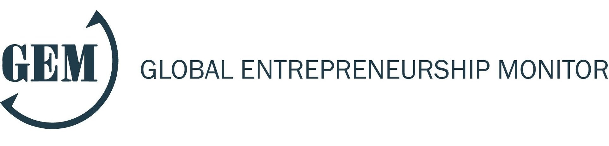
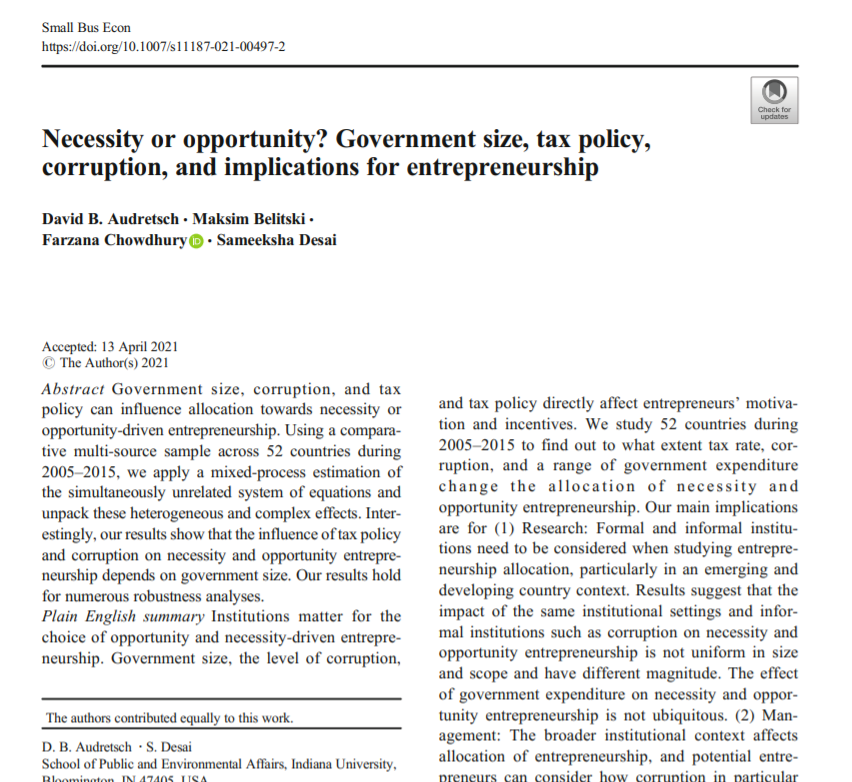
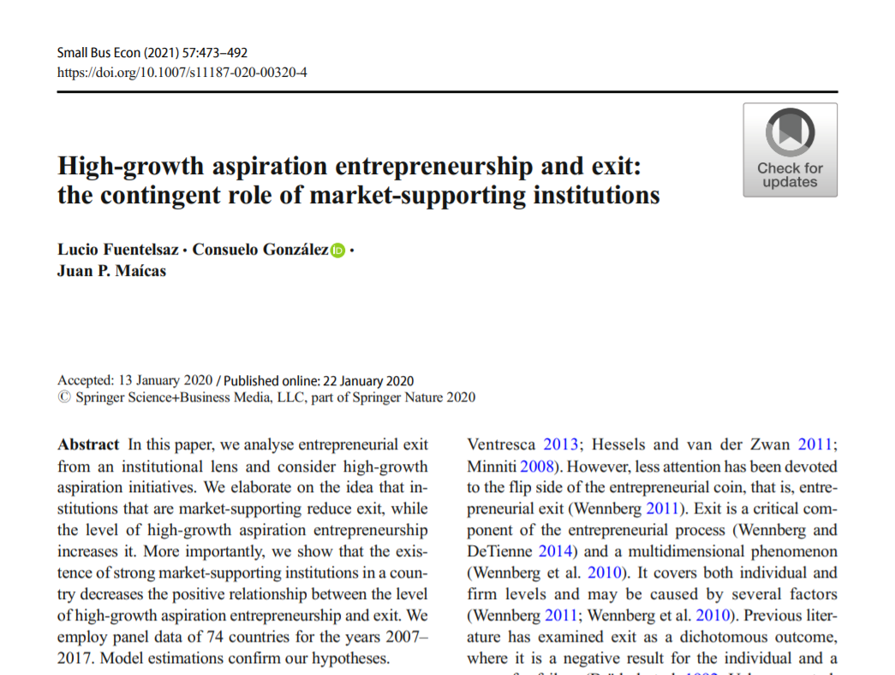
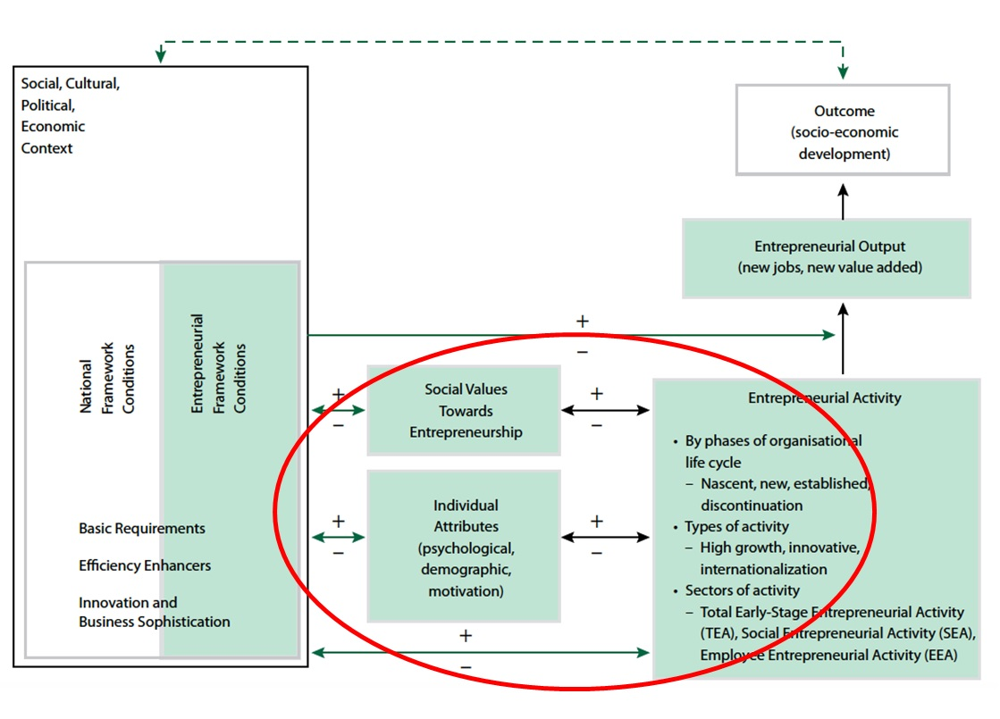
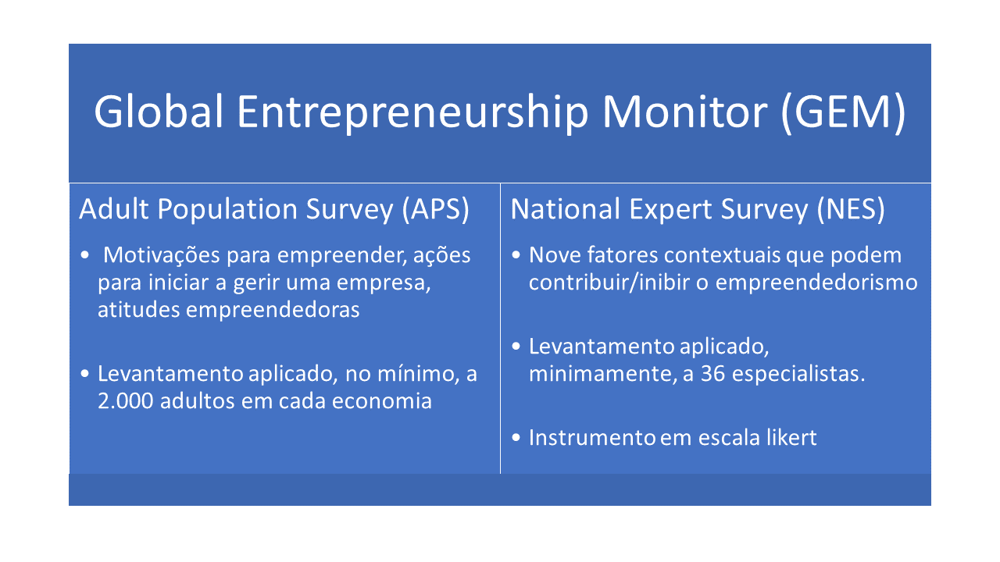

```{r set diretorio, message=FALSE, warning=FALSE, include=FALSE}
library(DT)
 setwd("~/GitHub/R_empreendedorismo2")
```

# Agradecimentos
<br>
```{r agradecimentos, figures-side, fig.show="hold", echo=FALSE, out.height="100%", out.width="100%", fig.align='center', fig.height=4, fig.cap=" "}

knitr::include_graphics("imagem/realizacao.png")

```


class: inverse, middle, left
# Divisão do curso 
* **Módulo 1: conceitos básicos de R** 
  + Cálculos básicos
  + Tipos de variáveis e objetos
  + O pacote dplyr para manipulação de dataframes
  + O pacote ggplot2 para visualização de dados
* **Módulo 2: usando o R para explorar o Global Entrepreneurship Monitor (GEM)**
  + Compreendedo as bases 
  + Tratando as bases 
  + Análise Exploratória dos Dados do GEM
* **Módulo 3: usando o R para explorar o Panel Study of Entrepreneurial Dynamics (PSED)**
  + Compreendendo a base
  + Tratando a base 
  + Análise Exploratória dos Dados do PSED

---
class: inverse, middle, left
# Objetivos do módulo 2
- Demonstrar relevância do GEM
- Explorar variáveis disponíveis no GEM 
- Aplicar funções para manipular dataframes 
- Aplicar análise exploratória dos dados

---
# Global  Entrepreneurship Monitor 

#### - O [GEM](https://www.gemconsortium.org/) foi criado em 1999 como um projeto conjunto entre a Babson College e a London Business School

#### - Pesquisas focam em atitudes/comportamento empreendedor bem como ecossistemas de empreendedorismo

#### - Levantamentos são realizados com empreendedores e especialistas 

#### - Divulgação de relatórios anuais sobre o empreendedorismo pelo mundo, por cada país e relatórios temáticos (ex.: [Impactos da Covid-19 no empreendedorismo](https://www.gemconsortium.org/reports/covid-impact-report))
<br>
```{r gem_logo, figures-side, fig.show="hold", echo=FALSE, out.height="100%", out.width="100%", fig.align='center', fig.height=3}


```

---
# Global  Entrepreneurship Monitor 

#### - Os microdados do GEM ficam disponíveis após três anos. Porém, no [site](http://gem-consortium.ns-client.xyz/data) é possível acessá-los 

#### - Para esse curso serão apresentados dados consolidados por países, disponível também no site 

#### - Tratar os microdados exigiria mais tempo e nivelamento em estatística para trabalhar com bases de amostragem complexa

#### - Os relatórios sobre o Brasil podem ser acessados no site do Instituto Brasileiro de Qualidade e Produtividade por desse [link](https://ibqp.org.br/gem/download/).  
<br>
```{r gem_logo2, figures-side, fig.show="hold", echo=FALSE, out.height="100%", out.width="100%", fig.align='center', fig.height=3}


```

---
# GEM e pesquisas

```{r artigo_gem1, figures-side, fig.show="hold", echo=FALSE, out.height="90%", out.width="90%", fig.align='center', fig.height=3}


```
---
# GEM e pesquisas

```{r artigo_gem2, figures-side, fig.show="hold", echo=FALSE, out.height="90%", out.width="90%", fig.align='center', fig.height=3}


```
---
# GEM e pesquisas

```{r artigo_gem3, figures-side, fig.show="hold", echo=FALSE, out.height="90%", out.width="90%", fig.align='center', fig.height=3}

knitr::include_graphics("imagem/artigo_gem3.png")
```

---
# Framework GEM

```{r gem_framework, figures-side, fig.show="hold", echo=FALSE, out.height="85%", out.width="85%", fig.align='center', fig.height=3}


```

fonte: [Base de conhecimento - framework](http://gem-consortium.ns-client.xyz/wiki/1148)

---
# Bases do GEM

```{r linguagens, figures-side, fig.show="hold", echo=FALSE, out.height="100%", out.width="100%", fig.align='center', fig.height=3, fig.cap=" "}


```

fonte: [Base de conhecimento do GEM](http://gem-consortium.ns-client.xyz/about/wiki)

---
# Base de especialistas
A base de especialistas do GEM contempla diferentes dimensões: 

* **Finanças empreendedoras**: disponibilidade de diferentes fontes de finanças para pequenas e médias empresas (PMEs)
* **Políticas governamentais**: o quanto as políticas públicas contribuem para o empreendedorismo
  + O quanto empreendedorismo é importante como uma política de governo
  + O quanto impostos e burocracia afetam empreendedorismo
* **Programas governamentais para empreendedorismo**: presença de programas governamentais para empreendedorismo 
* **Educação empreendedora**: presença de treinamentos sobre criação e gerenciamento de PMEs em diferentes graus de ensino
  + Nível básico 
  + Nível Superior
* **Transferência de Pesquisa & Desenvolvimento (P&D)**: o quanto pesquisas nacionais conduzem a criação de oportunidades comerciais e estão disponíveis para PMEs

---
# Base de especialistas 

* **Infraestrutura legal e comercial**: presença de serviços e instituições que fornecem suporte a PMEs 
* **Regulação de entrada**: que é dividida em a) dinamismo de mercado - o quanto o mercado muda de ano a ano; b) abertura de mercado - o quanto novas empresas são livres para entrar em mercados existentes 
* **Infraestrutura física**: facilidade de acessar recursos físicos (ex.: comunicação, logística, espaço físico)
* **Cultura e normas sociais**: o quanto normas sociais e culturais encorajam novos métodos de negócios que podem gerar riqueza e renda de uma pessoa 

Vamos começar lendo a base a partir do meu repositório do github: 

```{r lendo_nes, message=FALSE, warning=FALSE}
library(readr); library(dplyr); library(skimr)
library(ggplot2); library(ggrepel); library(directlabels)
library(GGally)

gem_especialistas <- read_delim("https://raw.githubusercontent.com/danielppagotto/R_empreendedorismo2/main/arquivos%20de%20bases/gem_nes_historico.csv", ";", escape_double = FALSE, trim_ws = TRUE)

```
---
# Compreendendo as variáveis da base 

```{r glimpse}
# Vamos usar o glimpse para conferir a base 
glimpse(gem_especialistas)
```
---
# Explorando base de especialistas
Vamos baixar a base e comparar alguns países: Brasil, Chile, Colômbia e México. 

Além disso, vamos separar algumas variáveis de interesse: `economy`, `year`, `gov_support`, `taxes_bureaucracy`, `gov_programs`, `internal_market_dynamics`.
<br>

```{r filte_gem, message=FALSE, warning=FALSE, echo=TRUE, results='hide'}

paises <- c("Brazil","Chile","Colombia","Mexico")


gem_paises_selecionados <- gem_especialistas %>% 
                              filter(economy %in% paises) %>% 
                              select(economy, year, gov_support, taxes_bureaucracy, 
                                     gov_programs, internal_market_dynamics)

# Estatísticas descritivas
gem_paises_selecionados %>%
  select(-year) %>% 
  group_by(economy) %>% 
  skim() 

```
---
# Plotando variáveis 

Vamos investigar a variável `gov_support` dos países ao longo do tempo. 

```{r ggplot0, fig.height=5,fig.width=10, fig.align='center'}

gem_paises_selecionados %>% 
  ggplot(aes(year,gov_support)) + geom_line() 

```
---
# Adicionando o parâmetro col 
Vamos ainda destacar mais a linha e retirar esse fundo cinza
```{r ggplot1, fig.height=5,fig.width=10, fig.align='center'}

gem_paises_selecionados %>% 
  ggplot(aes(year,gov_support, col = economy)) + geom_line(size = 2) +
  theme_minimal()
```
---
# Adicionando títulos

```{r ggplot2, fig.height=5,fig.width=10, fig.align='center'}

gem_paises_selecionados %>% 
  ggplot(aes(year,gov_support, col = economy)) + geom_line(size = 2) +
  theme_minimal() + xlab("Ano") + ylab("Suporte Governamental") +
  ggtitle("Suporte Governamental", "Comparação entre Brasil, Chile, Colombia e México - Dados GEM")
```
---
# Adicionando textos às linhas 

```{r ggplot3, fig.height=5, fig.width=10, fig.align='center'}

gem_paises_selecionados %>% 
  ggplot(aes(year,gov_support, col = economy)) + geom_line(size = 2) +
  geom_dl(aes(label = economy), method = list(dl.combine("first.points", "last.points"))) +
  theme_minimal() + xlab("Ano") + ylab("Suporte Governamental") +
  ggtitle("Suporte Governamental", "Comparação entre Brasil, Chile, Colombia e México - Dados GEM")
```

---
# Aumentando fontes
Vamos aumentar as fontes e retirar a legenda
```{r ggplot4, fig.height=4,fig.width=10, fig.align='center'}

gem_paises_selecionados %>% 
  ggplot(aes(year,gov_support, col = economy)) + geom_line(size = 2) +
  geom_dl(aes(label = economy), method = list(dl.combine("first.points", "last.points"))) +
  theme_minimal() + xlab("Ano") + ylab("Suporte Governamental") + theme(legend.position = "none") +
  theme(plot.title = element_text(size=22)) + theme(axis.title.y = element_text(size = rel(1.2), angle = 90)) + theme(axis.title.x = element_text(size = rel(1.2), angle = 0)) + ggtitle("Suporte Governamental", "Comparação entre Brasil, Chile, Colombia e México - Dados GEM")

```

---
# Mudando a escala
Vamos aumentar as fontes e retirar a legenda
```{r ggplot5, fig.height=4,fig.width=10, fig.align='center'}

gem_paises_selecionados %>% 
  ggplot(aes(year,gov_support, col = economy)) + geom_line(size = 2) +
  geom_dl(aes(label = economy), method = list(dl.combine("first.points", "last.points"))) +
  theme_minimal() + xlab("Ano") + ylab("Suporte Governamental") + theme(legend.position = "none") +
  theme(plot.title = element_text(size=22)) + theme(axis.title.y = element_text(size = rel(1.2), angle = 90)) + theme(axis.title.x = element_text(size = rel(1.2), angle = 0)) + ggtitle("Suporte Governamental", "Comparação entre Brasil, Chile, Colombia e México - Dados GEM") +
scale_x_continuous(breaks = seq(2010,2020,1)) 

```
---
# Exercício de fixação 

#### Tente fazer o mesmo exercício para outras variáveis, outros países e outros espaços temporais 

```{r homework, echo=FALSE, out.height="50%", out.width="50%",fig.align='center'}
knitr::include_graphics("https://media.giphy.com/media/H1f1T0tKK4jEfNt6MG/giphy.gif")

```
<br>
Fonte: [giphy](https://media.giphy.com/media/H1f1T0tKK4jEfNt6MG/giphy.gif)
---
# Explorando dados de APS
Os dados consolidados do levantamento com população adulta é composto pelas seguintes variáveis: 

* **Taxa de Oportunidades Percebidas**: Percentual de indivíduos de 18 a 64 anos (exceto aqueles envolvidos em algum estágio de atividade empreendedora) que enxergam boas oportunidades para se iniciar um negócio na área onde vivem. 

* **Taxa de atividade empreendedora total (TAE)**: Percentual da população de 18 a 64 anos que é um empreendedor nascente ou proprietário-gerente de um novo negócio.

* **Medo de fracassar**: Percentual da população de 18 a 64 anos (indivíduos envolvidos em qualquer estágio da atividade empresarial excluídos) que indicam que o medo do fracasso os impedem de abrir um negócio.

* **Empreendedorismo como boa escolha de carreira**: Percentual da população de 18 a 64 anos que concorda com a afirmação de que, em seu país, a maioria das pessoas considera iniciar um negócio como uma escolha de carreira desejável.

Para conhecer todas acesse [aqui](https://www.gemconsortium.org/wiki/1154). 

---
# Associando o GEM a outras bases 

Muitas pesquisas utilizam o GEM associado a outras bases. Para o nosso exercício, vamos utilizar dados da Worldwide Governance Indicator (WGI) que pode ser acessada por meio da seguinte [página](https://info.worldbank.org/governance/wgi/). 

### *"Governança consiste na tradição e nas instituições pelas quais a autoridade em um país é exercida. Isso inclui o processo pelo qual um governante é escolhido, monitorado e substituído; a capacidade do governo formular efetivamente e implementar políticas sólidas; e o respeito dos cidadãos e do Estado pelas instituições que regem as interações econômicas e sociais entre eles."* (WGI)

As variáveis variam entre -2,5 (fraco índice de governança) a 2,5 (forte índice de governança). Para fins didáticos, transformei o indicador para variar de 0 a 5 pontos.  

---
# Conhecendo variáveis do WGI

* **Control of Corruption**: Reflete as percepções da extensão em que o poder público é exercido para ganho privado, incluindo formas insignificantes e grandes de corrupção, bem como a "captura" do Estado pelas elites e interesses privados.

* **Rule of Law**: Reflete as percepções sobre o nível em que os agentes confiam e cumprem as regras da sociedade e, em particular, a qualidade da execução de contratos, direitos de propriedade, polícia e tribunais, bem como a probabilidade de crime e violência.

* **Regulatory Quality**: Reflete a percepção da capacidade do governo de formular e implementar políticas e regulamentações sólidas que permitam e promovam o desenvolvimento do setor privado.

* **Politicial Stability and Absence of Violence/Terrorism**: A Estabilidade Política e Ausência de Violência/Terrorismo mede as percepções da probabilidade de instabilidade política e/ou violência com motivação política, incluindo terrorismo.

* **Voice and Accountability**: Reflete as percepções sobre o nível em que os cidadãos de um país podem participar da seleção de seu governo, bem como a liberdade de expressão, a liberdade de associação e a liberdade de mídia.
---
# Juntando bases

Vamos juntar as bases, selecionar as variáveis de interesse e, finalmente, inspecionar alguns dados de estatística descritiva por continente. 

Lendo as bases a partir do GitHub
```{r lendobasess, message=FALSE, warning=FALSE, echo=TRUE, results='hide'}

wgidataset <- read_csv("https://raw.githubusercontent.com/danielppagotto/R_empreendedorismo2/main/arquivos%20de%20bases/wgi.csv")

gem_aps <- read_delim("https://raw.githubusercontent.com/danielppagotto/R_empreendedorismo2/main/arquivos%20de%20bases/gem_2019_aps.csv", ";", escape_double = FALSE, trim_ws = TRUE)

gem_wgid <- gem_aps %>% 
                  left_join(wgidataset, by = c("abrev" = "code")) %>% 
                  select(economy, continent, tea, perceived_opportunities,
                         fear_failure, established_ownership, 
                         entrepreneurship_as_good_carrer_choice,
                         corruption, rule_of_law, regulatory_quality, 
                         political_stability, voice_accountability)


gem_wgid %>%
  group_by(continent) %>% 
  skim() 
```
---
# Estatística descritiva - GGally

```{r ggally, message=FALSE, warning=FALSE, fig.align='center', fig.height=6.5, fig.width=7}
gem_wgid %>% select(-economy,-continent) %>% 
  ggpairs()
```
---
# Explorando mais... 

Vamos explorar mais a fundo a variável `Entrepreneurship as good carrer choice`. 

```{r estabilidade, fig.height=5, message=FALSE, warning=FALSE, fig.align='center'}
gem_wgid %>% 
  ggplot(aes(x = political_stability, y = entrepreneurship_as_good_carrer_choice)) +
  geom_point() + theme_minimal() + geom_smooth(method = "lm", se = FALSE)

```
---
# e mais... 

```{r estabilidade2, fig.height=5, message=FALSE, warning=FALSE, fig.align='center'}
gem_wgid %>% 
  ggplot(aes(x = political_stability, y = entrepreneurship_as_good_carrer_choice)) +
  geom_point(aes(col = continent, size = 1.5)) + 
  theme_minimal() + geom_text_repel(aes(label = economy)) + 
  theme(legend.position = "none") + geom_smooth(method = "lm", se = FALSE)

```
---
# Aplicando facet_grid()
```{r estabilidade3, fig.height=5, message=FALSE, warning=FALSE, fig.align='center'}
gem_wgid %>% 
  ggplot(aes(x = political_stability, y = entrepreneurship_as_good_carrer_choice)) +
  geom_point(aes(col = continent, size = 1.5)) + facet_grid(~continent) +
  theme_minimal() + theme(legend.position = "none") + geom_smooth(method = "lm", se = FALSE)

```
---
# Podemos voltar ao GGAlly
Podemos fazer filtragem de um continente apenas e verificar o resultados das variáveis

```{r ggally_europa, fig.align='center', fig.height=5, message=FALSE, warning=FALSE}
gem_wgid %>% 
  filter(continent == "Europa") %>% 
  select(-economy,-continent) %>% 
  ggpairs()
```
---
# Exercício de fixação 

#### Tente fazer o mesmo exercício para outras variáveis ou filtrando outro continente

```{r homework2, echo=FALSE, out.height="50%", out.width="50%",fig.align='center'}
knitr::include_graphics("https://media.giphy.com/media/H1f1T0tKK4jEfNt6MG/giphy.gif")

```
<br>
Fonte: [giphy](https://media.giphy.com/media/H1f1T0tKK4jEfNt6MG/giphy.gif)

---
class: inverse, middle, center

# Obrigado

**Daniel Pagotto** | danielppagotto@gmail.com | [LinkedIn](https://www.linkedin.com/in/daniel-do-prado-pagotto-bab62a50/)


